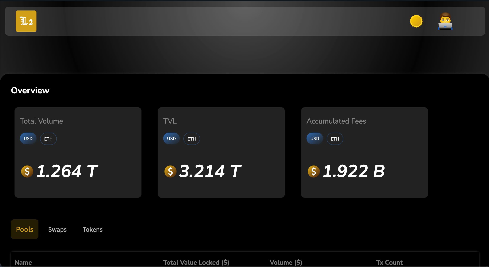
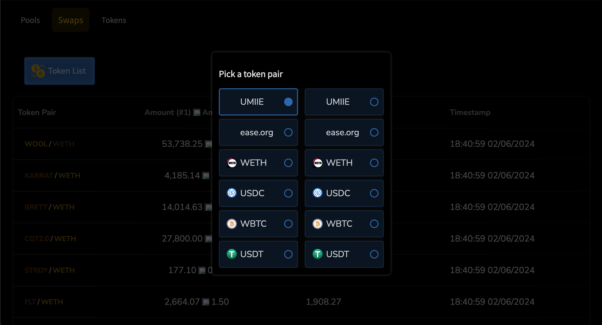

# L2 (Liqudity Lens DApp)

## Description

A Uniswap ⚔️ The Graph powered DApp

### Getting Started

First, run the development server:

```bash
npm run dev
# or
yarn dev
# or
pnpm dev
# or
bun dev
```

Open [http://localhost:3000](http://localhost:3000) with your browser to see the result.

You can start editing the page by modifying `app/page.tsx`. The page auto-updates as you edit the file.

This project uses [`next/font`](https://nextjs.org/docs/basic-features/font-optimization) to automatically optimize and load Inter, a custom Google Font.

## Inside The DApp

<div align="center">
    
    <h3>#1</h3>
    <br />
    
    <h3>#2</h3>
</div>

## Live Version

- [Live Version](https://liquidity-lens-dapp.vercel.app/)
